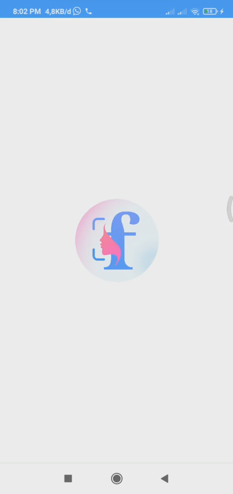
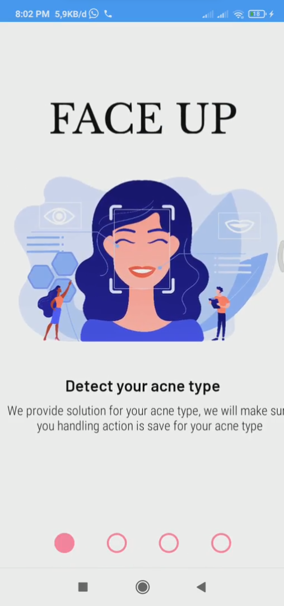
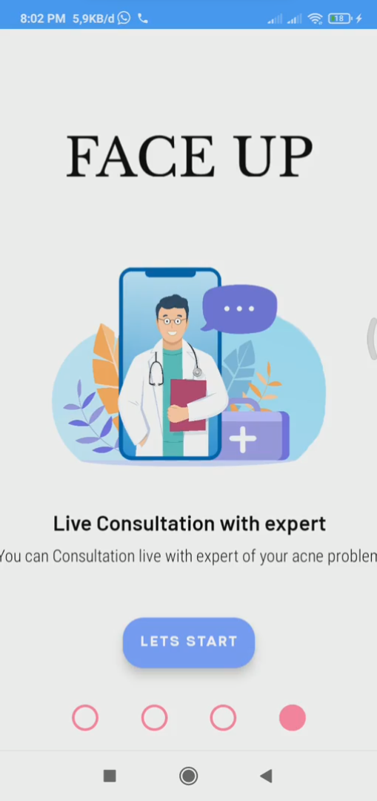
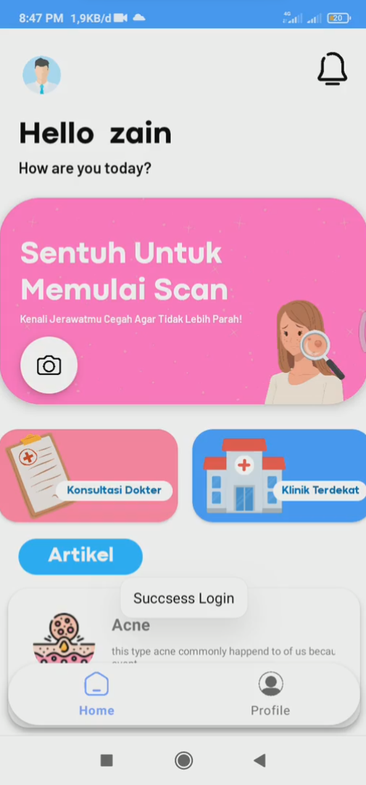
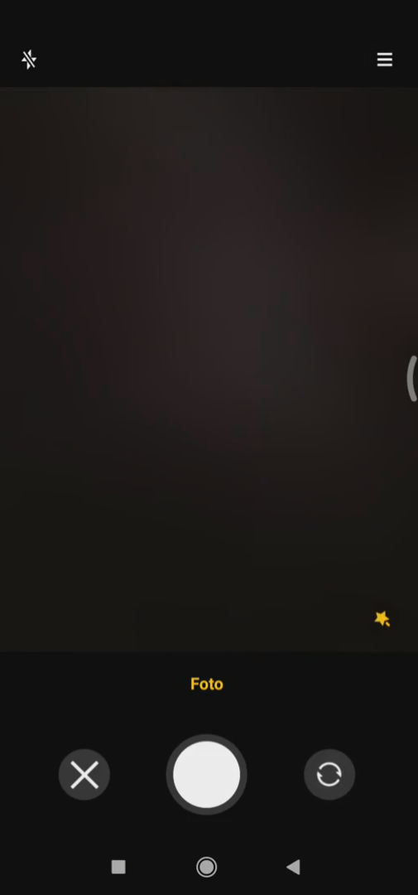
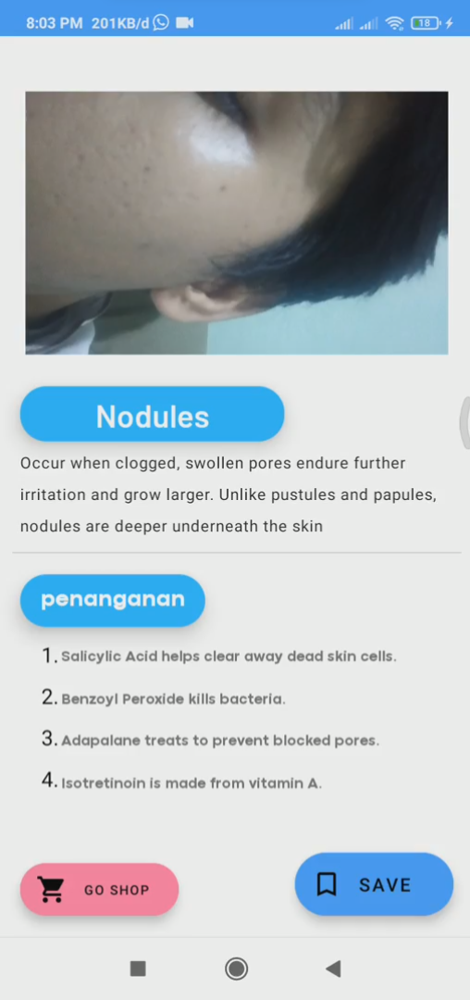

# FaceUp by C23-PS205
> This repository is made for Bangkit Capstone Project documentation.
 

  
  <h2 align="center">FaceUp "Keep your face up!"</h2>

Acne analysis mobile application that provides a complete solution, regarding the type of acne including recommendations for the appropriate ingredients to use.

Capstone Project for Bangkit 2023 by team C23-PS205

# Project Documents

 - [Machine Learning](https://github.com/RizkiFauziahArief/git-faceup/tree/main/machine-learning)
 - [Cloud Computing](https://github.com/RizkiFauziahArief/git-faceup/tree/main/cloud-computing)
 - [Mobile Development](https://github.com/RizkiFauziahArief/git-faceup/tree/mobile-development)

# Team Members

|       Name              | Bangkit Student ID	  | Learning Path        |
|     :------------:      |:---------------:      | :-----:              |
|  Raihanny Athifa Zahra  | M169DSY1294           |  Machine Learning    |
|  Yunike Warda Nabila    | M169DSY1555           |  Machine Learning    |
|  Rizki Fauziah Arief    | C339DSY0830           |  Cloud Computing     |
|  Indriani Astuti        | C339DSY1632           |  Cloud Computing     |
|  Zain Zaidan Ahsan      | A375DKX4172           |  Android Development |
|  Ahmad Fadhlur Rahman   | A375DSX1696           |  Android Development |

# Documentation

   

  
