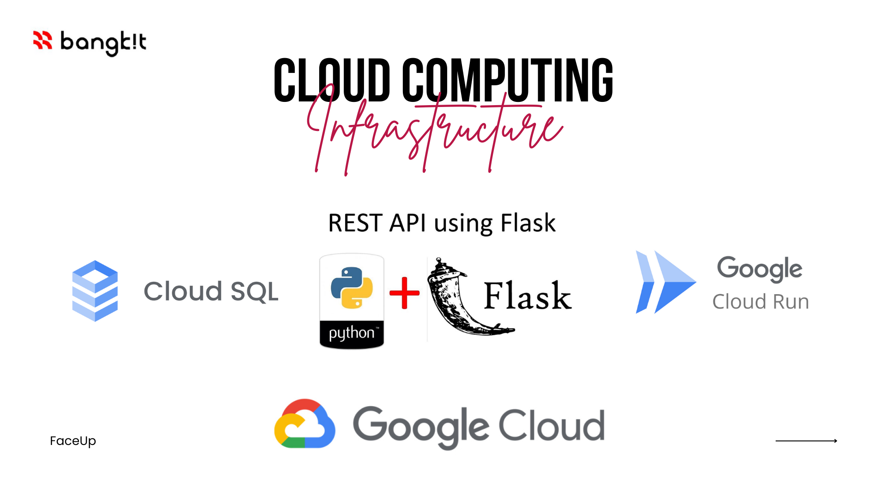

# Cloud Computing

## FaceUp REST API Documentation

For API documentation, see the following link

<a href="https://documenter.getpostman.com/view/24719932/2s93sgYBDD">REST API Documentation

# Cloud Service

## Cloud SQL

Instance ID       : db-capstone-project

Database Version  : MySQL 5.7

Region            : asia-southeast2 (jakarta)

Storage           : 628.74 MB

## Cloud Run

Service Name       : api-faceup-capstone

Region             : australia-southeast1 (sydney)

Container Port     : 8080

Capacity           : Memori (1 GiB), CPU (1)
